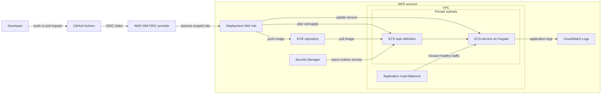

# Architecture

This repository models a production-style ECS Fargate deployment pattern.

## Reference Architecture

The diagram is intentionally high level. A real deployment should also include NAT or VPC endpoints, security groups, route tables, autoscaling, alarms, and environment-specific controls.

## Core Components

- **GitHub Actions** runs validation and Terraform planning.
- **AWS OIDC role** allows GitHub Actions to assume AWS permissions without storing access keys.
- **Terraform** defines reusable cloud resources.
- **Atmos** separates reusable components from environment-specific stack configuration.
- **ECS Fargate** runs the application container without managing EC2 hosts.
- **Application Load Balancer** routes traffic to healthy ECS tasks.
- **Amazon ECR** stores versioned container images.
- **CloudWatch Logs** stores application logs.
- **Secrets Manager** provides sensitive runtime values to the container.

## Recommended Network Pattern

The ECS service should run in private subnets with `assign_public_ip = false`. Public access should terminate at an Application Load Balancer, CloudFront, or a controlled edge layer such as Cloudflare.

## Security Notes

- Use GitHub OIDC instead of static AWS access keys.
- Scope the GitHub role to the required environment and repository.
- Store sensitive values in Secrets Manager.
- Avoid broad ingress rules such as `0.0.0.0/0` directly to workloads.
- Use ECS Exec only with audit logging and restricted IAM permissions.

## Environment Separation

A real implementation should separate development, staging, and production by AWS account or by tightly controlled environment boundaries. The stack file in this repository is an example only.
