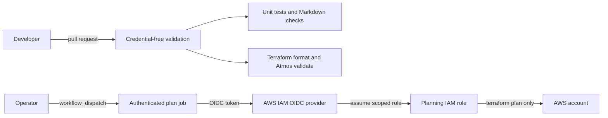

# Architecture

This repository models a production-style ECS Fargate deployment pattern while keeping the included GitHub Actions workflow deliberately limited.

## Included Workflow Boundary

The executable workflow in this repository has two paths:



Pull requests do not receive AWS credentials and do not run a Terraform plan. The manual `workflow_dispatch` path can use GitHub OIDC to obtain short-lived AWS credentials and run a plan after validation succeeds. The included workflow does not run `terraform apply`, build or push container images, or update an ECS service.

## Target Production Architecture

The following diagram shows the broader architecture an adopter may build around the Terraform/Atmos component. The delivery steps shown here are conceptual production extensions, not actions performed automatically by this repository today.

```mermaid
flowchart LR
    delivery[Production delivery pipeline\n(adopter-added)] -->|OIDC token| oidc[AWS IAM OIDC provider]
    oidc -->|assume scoped role| deployRole[Deployment IAM role]

    subgraph aws[AWS account]
        ecr[ECR repository]
        secrets[Secrets Manager]
        logs[CloudWatch Logs]

        subgraph vpc[VPC]
            alb[Application Load Balancer]

            subgraph private[Private subnets]
                ecs[ECS service on Fargate]
                task[ECS task definition]
            end
        end

        deployRole -->|push approved image| ecr
        deployRole -->|reviewed apply| task
        deployRole -->|update service| ecs
        ecr -->|pull immutable image| task
        secrets -->|inject runtime secrets| task
        task --> ecs
        alb -->|forward healthy traffic| ecs
        ecs -->|application logs| logs
    end
```

The production diagram is intentionally high level. A real deployment should also include NAT or VPC endpoints, security groups, route tables, autoscaling, alarms, environment approvals, artifact-promotion controls, and environment-specific policy.

## Core Components

- **GitHub Actions** runs credential-free pull-request validation and an explicitly dispatched authenticated Terraform plan.
- **AWS OIDC role** allows the manual plan job—and any adopter-built deployment workflow—to use short-lived AWS credentials instead of stored access keys.
- **Terraform** defines reusable cloud resources.
- **Atmos** separates reusable components from environment-specific stack configuration.
- **ECS Fargate** runs the application container without managing EC2 hosts.
- **Application Load Balancer** routes traffic to healthy ECS tasks.
- **Amazon ECR** stores versioned container images in a complete production implementation.
- **CloudWatch Logs** stores application logs.
- **Secrets Manager** provides sensitive runtime values to the container.

## Recommended Network Pattern

The ECS service should run in private subnets with `assign_public_ip = false`. Public access should terminate at an Application Load Balancer, CloudFront, or a controlled edge layer such as Cloudflare.

## Security Notes

- Use GitHub OIDC instead of static AWS access keys.
- Scope the GitHub role to the required environment and repository.
- Keep pull-request validation credential-free where live cloud access is unnecessary.
- Store sensitive values in Secrets Manager.
- Avoid broad ingress rules such as `0.0.0.0/0` directly to workloads.
- Use ECS Exec only with audit logging and restricted IAM permissions.

## Environment Separation

A real implementation should separate development, staging, and production by AWS account or by tightly controlled environment boundaries. The stack file in this repository is an example only.
